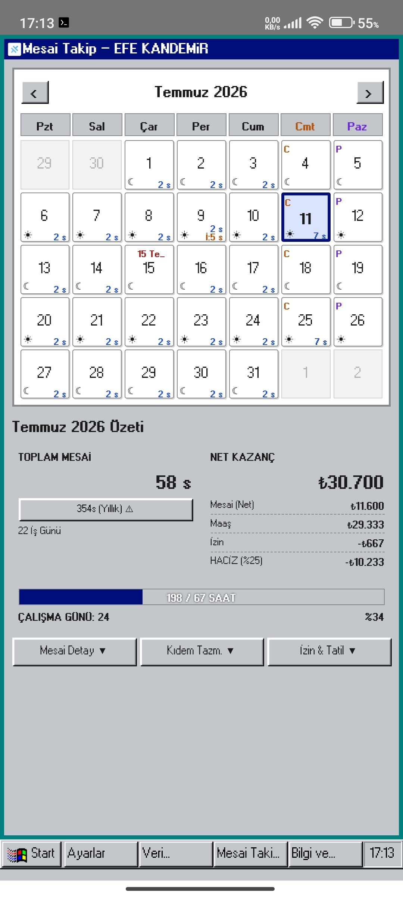
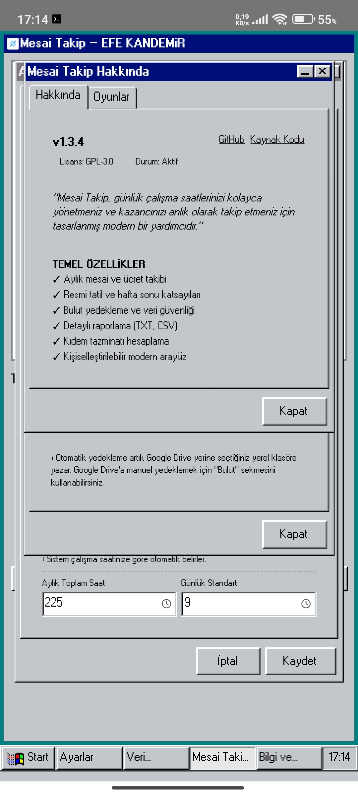
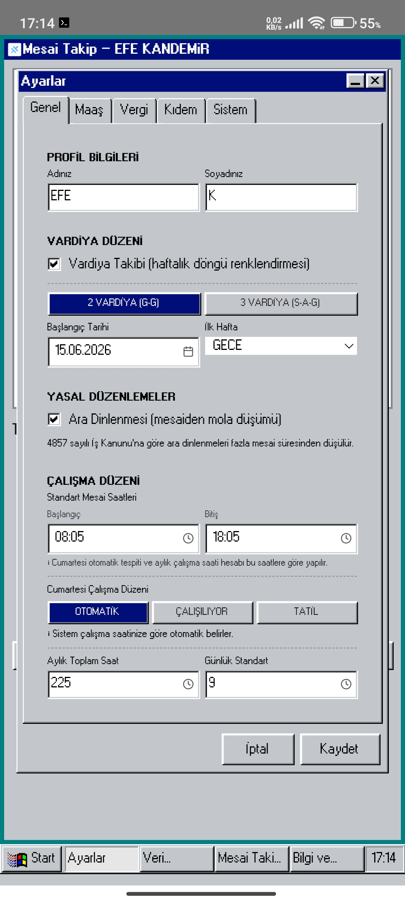
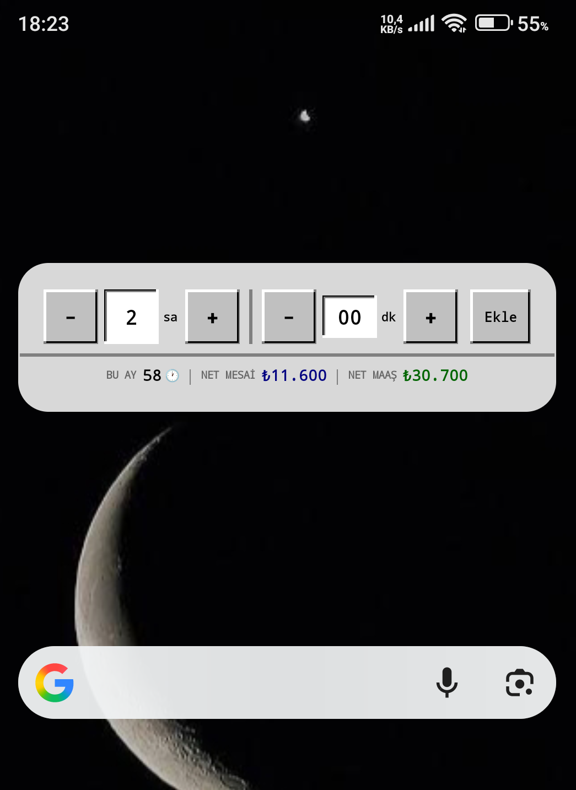
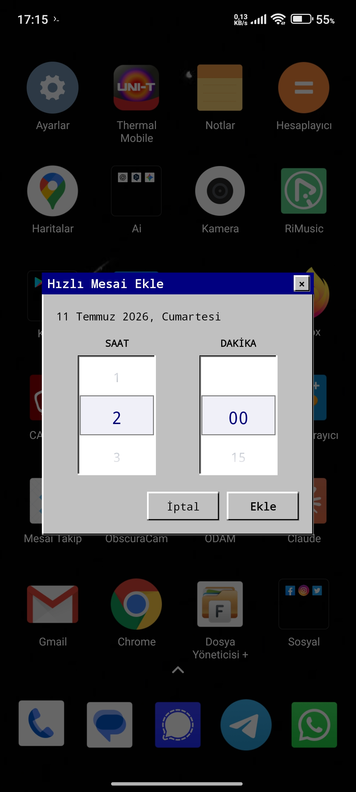
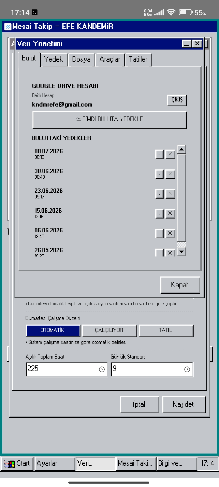
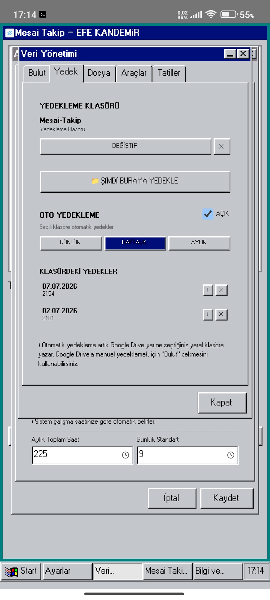

## Screenshots





```text
################################################################################
#                                                                              #
#   __  __ ______  _____         _____  _______       _  _______ _____         #
#  |  \/  |  ____|/ ____|  /\   |_   _||__   __|     | |/ /_   _|  __ \        #
#  | \  / | |__  | (___   /  \    | |     | |   __ _ | ' /  | | | |__) |       #
#  | |\/| |  __|  \___ \ / /\ \   | |     | |  / _` ||  <   | | |  ___/        #
#  | |  | | |____ ____) / ____ \ _| |_    | | | (_| || . \ _| |_| |            #
#  |_|  |_|______|_____/_/    \_\_____|   |_|  \__,_||_|\_\_____|_|            #
#                                                                              #
#               >> MESAİ TAKİP SİSTEMİ <<                                      #
#                                                                              #
################################################################################

[SYSTEM_INFO]
-------------
[+] TARGET      : Modern ve kullanıcı dostu mesai takip uygulaması.
[+] ENVIRONMENT : React, TypeScript & Tailwind CSS.
[+] STATUS      : STABLE / READY FOR DEPLOYMENT
[+] KERNEL      : Vite v7.3.6
[+] ONLINE      : https://mesaitakip.github.io
---

[FEATURES_MANIFEST]
-------------------
[*] MODULE_01: Aylık Mesai Takibi - Günlük verileri sisteme enjekte eder.
[*] MODULE_02: Akıllı Ücret Hesaplama - Dinamik katsayı algoritması aktif.
[*] MODULE_03: Resmi & Dini Tatil Desteği - 2025-2035 DB + Online Sync + Manuel Ekleme.
[*] MODULE_04: Detaylı Raporlama - Derinlemesine veri analizi ve özetler.
[*] MODULE_05: Mesai Notları - Her entry için metadata desteği.
[*] MODULE_06: Veri Yedekleme - Google Drive (OAuth2/PKCE) + Yerel Klasör Auto-Backup.
[*] MODULE_07: Maaş Ayarları - Vergi parametreleri (Bypass Tax Limits).
[*] MODULE_08: Mobil Uyumlu - Android Native APK desteği.
[*] MODULE_09: Modern Tasarım - Optimize edilmiş UI/UX motoru.
[*] MODULE_10: Win95 Retro Tema - Klasik/nostaljik arayüz sevenler için alternatif tema.
[*] MODULE_11: Vergi Dilimi Hesaplama - Gelir vergisi tarifesi (2026 dilimleri) dinamik motor.
[*] MODULE_12: Kıdem & İhbar Tazminatı - 4857 Sayılı İş Kanunu Md. 17 uyumlu hesaplama.
[*] MODULE_13: Mesai & Maaş Günü Hatırlatıcı - Native bildirim tetikleyici (Android).
[*] MODULE_14: Android Native Sürüm Güncelleme Kontrolü - GitHub Releases API polling.
[*] MODULE_15: Yıllık İzin Takibi - 4857 Sayılı Kanun Md. 53 kıdem bazlı gün hesabı.
[*] MODULE_16: Yol/Yemek Takibi - Günlük yardım kaydı ve otomatik hesaplama.
[*] MODULE_17: Yasal Kesintiler - Maaş Haczi (%) & TES/BES Kesinti Motoru.
[*] MODULE_18: Mini Oyun Paketi - 2048, Sudoku & Kelime Bulmaca (offline).
[*] MODULE_19: Bilgi & Duyurular - Uzaktan Markdown besleme (6 saat cache TTL).
[*] MODULE_20: Windows Masaüstü Desteği - Tauri 2 Engine (.exe/.msi bundle).

---

[DEPLOYMENT_SCRIPT]
-------------------
$ npm install
$ npm run build
$ npx cap sync
$ cd android
$ ./gradlew assembleDebug

[INFO] Output: android/app/build/outputs/apk/debug/MesaiTakip.versionName.apk

[WINDOWS_BUILD]
$ npx tauri build

[INFO] Output: src-tauri/target/release/bundle/MesaiTakip.versionName(.exe / .msi)

---

[CALCULATION_PAYLOAD]
---------------------
[0x01] HAFTAİÇİ_MESAI   : 1.5x (Variable)
[0x02] CUMARTESİ_MESAI  : 1.5x (Variable)
[0x03] PAZAR_MESAI      : 2.5x (Fixed)
[0x04] RESMİ_TATİL_MESAİ: 2.0x (Priority)

[!] NOTICE: Hesaplamalar net tutarlar üzerinden yapılmaktadır.

---

[HOLIDAY_DATABASE]
------------------
[OFFICIAL_HOOKS]
- [1] 1 Ocak Yılbaşı
- [2] 21 Mart Nevruz Bayramı [+] NEW_UPDATE
- [3] 23 Nisan Ulusal Egemenlik ve Çocuk Bayramı
- [4] 1 Mayıs Emek ve Dayanışma Günü
- [5] 19 Mayıs Gençlik ve Spor Bayramı
- [6] 15 Temmuz Demokrasi ve Milli Birlik Günü
- [7] 30 Ağustos Zafer Bayramı
- [8] 29 Ekim Cumhuriyet Bayramı

[RELIGIOUS_HOOKS]
- Ramazan Bayramı (3 Days Loop)
- Kurban Bayramı (4 Days Loop)

[SYNC_ENGINE]
- [ONLINE_UPDATE] : resmi.json / dini.json üzerinden otomatik senkron (30 gün cache TTL).
- [MANUAL_INJECT] : Kullanıcı tanımlı özel tatil ekleme/düzenleme/silme desteklenir.
- [FALLBACK]      : Sunucuya erişilemezse yerel dahili veritabanına düşer.

---

[TECH_STACK_OVERRIDE]
---------------------
[CORE]    : React 18 + TypeScript
[STYLE]   : Tailwind CSS
[THEME]   : @react95/core - Win95 Retro Tema Motoru
[ICONS]   : Lucide React (Vector-only)
[BRIDGE]  : Capacitor (Android Engine)
[STORAGE] : @capacitor/preferences (Native persistent storage)

---

[DATA_ENFILTRATION]
-------------------
[+] AUTO_SAVE : Real-time persistent storage enabled.
[+] EXPORT    : JSON data format supported.
[+] SHARE     : Native sharing API integration.
[+] SECURITY  : 0-Server Leakage. All data remains on-device.

---

[BACKUP_PROTOCOL]
------------------
[CLOUD]  : Google Drive - Manuel yedekleme (OAuth2 PKCE + Refresh Token).
[LOCAL]  : Otomatik Yedekleme - Yerel klasöre yazar (SAF / File System Access API).
[PERIOD] : Günlük / Haftalık / Aylık interval seçilebilir.
[REASON] : Google OAuth refresh token'ları test projelerinde periyodik olarak
           geçersiz oluyor; bu yüzden AUTO mekanizması hesap/internet
           gerektirmeyen yerel klasöre kaydırıldı. Manuel Drive yedeği
           "Bulut" sekmesinden hâlâ kullanılabilir.
[OFFLINE]: Telefon değişikliği veya internet kesintisinde bile yedek
           dosyasına erişim garantili.

---

[AUTHOR_CREDENTIALS]
--------------------
[USER] : efek0349
[MAIL] : kndmrefe@gmail.com
[TG]   : https://t.me/efek0349
[GPG]  : [publickey.asc] (https://raw.githubusercontent.com/efek0349/dotfiles/refs/heads/openbsd/publickey.asc)

---

[LICENSE_AGREEMENT]
-------------------
LICENSE : GPL-3.0 (Open Source)

[CONTRIBUTION]
- Clone Repo
- Inject Code
- Send Pull Request

---

[!] WARNING: Bu yazılım kişisel takip içindir. Muhasebe işlemleri için uzman onayı alınız.
```
